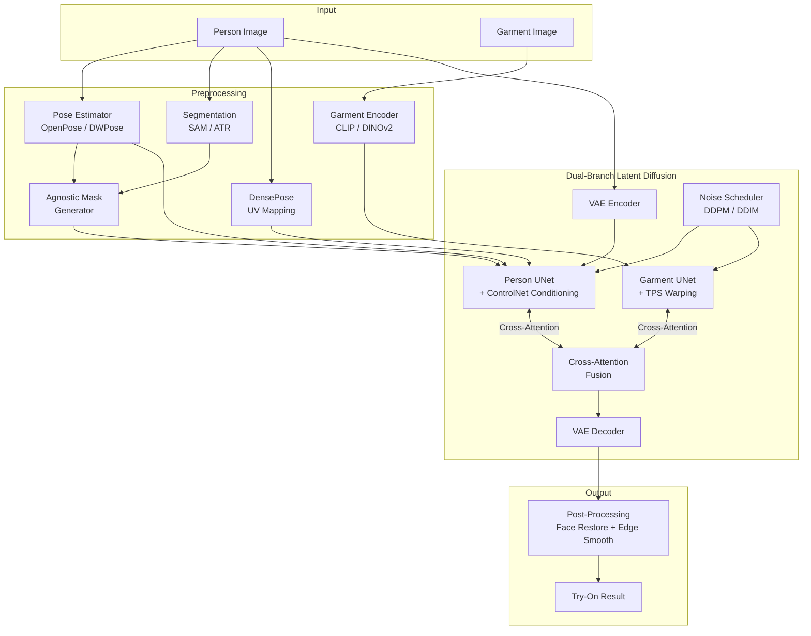

# DiffFit-3D

**Geometry-Aware Virtual Try-On: Synergizing 3D Garment Fitting with Controlled Diffusion Models**

DiffFit-3D is a hybrid virtual try-on pipeline that combines 3D human body estimation (SMPL-X) and differentiable garment rendering with Latent Diffusion Models to achieve geometrically accurate, photorealistic garment fitting across diverse body shapes and camera perspectives.

## Architecture



## Key Features

- **Perspective Consistency** — Natural garment fitting even in side/back views via 3D body estimation
- **Body Inclusivity** — 3D mesh-based fitting ensures accuracy across all body types
- **Photorealism** — ControlNet-guided diffusion with perceptual + adversarial losses
- **Occlusion Handling** — Robust DensePose-based layering for complex occlusions
- **Video Support** — Temporal attention + motion modules for consistent animated try-on
- **Production Ready** — FastAPI serving, Triton support, ONNX export

## Quick Start

### Installation

```bash
# Clone
git clone https://github.com/DiffFit-3D/DiffFit-3D.git
cd DiffFit-3D

# Install (basic)
pip install -e .

# Install (all features including 3D and serving)
pip install -e ".[dev,serve,threed]"
```

### Inference

```bash
# Single image try-on
python scripts/inference.py \
    --config configs/inference.yaml \
    --person path/to/person.jpg \
    --garment path/to/garment.jpg \
    --output results/output.png

# Video try-on
python scripts/inference.py \
    --config configs/inference.yaml \
    --person path/to/person.mp4 \
    --garment path/to/garment.jpg \
    --output results/output.mp4 \
    --mode video
```

### Training

```bash
# Preprocess dataset
make preprocess

# Train
make train

# Or with custom config
python scripts/train.py --config configs/train.yaml
```

### Evaluation

```bash
python scripts/evaluate.py --config configs/inference.yaml
```

## Project Structure

```
DiffFit-3D/
├── configs/           # YAML configuration files
├── src/
│   ├── models/        # UNet branches, VAE, attention, pipeline
│   ├── modules/       # Garment encoder, pose, segmentation, warping
│   ├── training/      # Training loop, losses, LR scheduler, EMA
│   ├── inference/     # Image & video try-on inference
│   ├── video/         # Temporal attention, motion, physics
│   ├── data/          # Dataset, transforms, preprocessing
│   └── utils/         # Image/video utils, metrics, watermark
├── scripts/           # CLI entry points
├── serving/           # FastAPI + Celery + Triton deployment
├── frontend/          # React demo UI
├── tests/             # Unit tests
└── checkpoints/       # Model weights (gitignored)
```

## Citation

```bibtex
@software{difffit3d2024,
    title={DiffFit-3D: Geometry-Aware Virtual Try-On},
    year={2024},
    url={https://github.com/DiffFit-3D/DiffFit-3D}
}
```

## License

Apache 2.0
