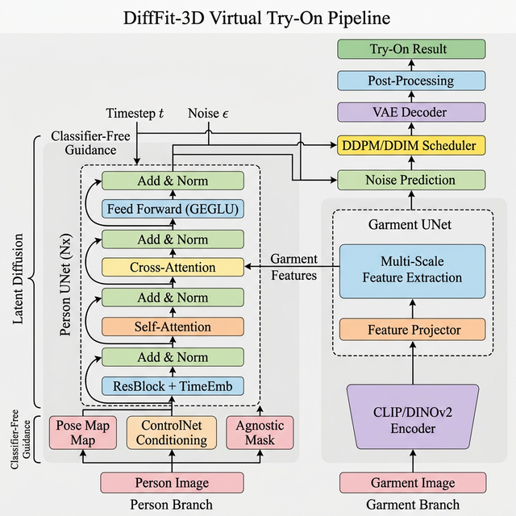
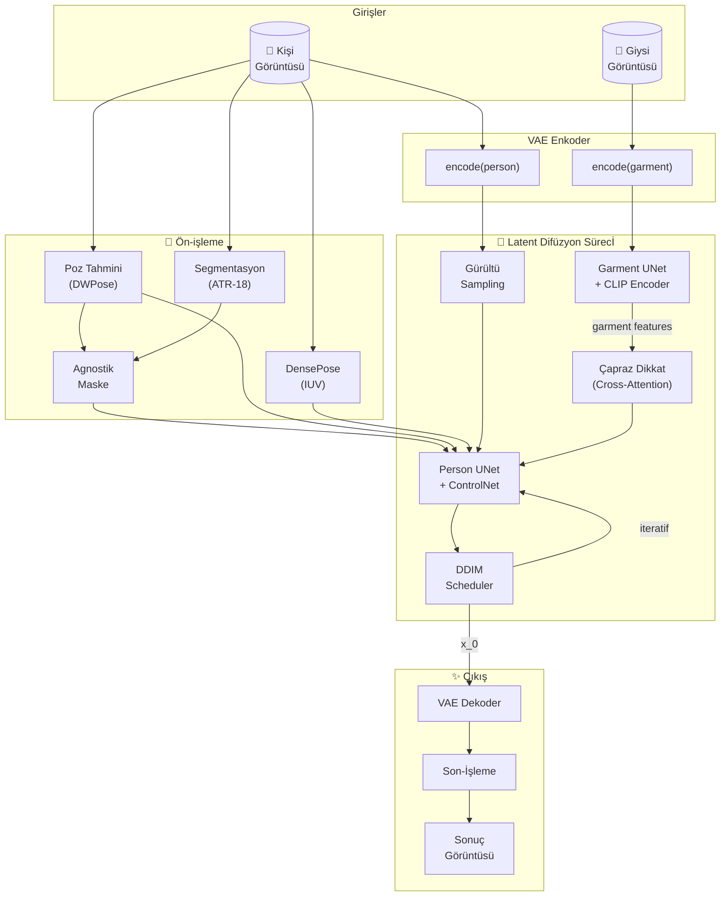
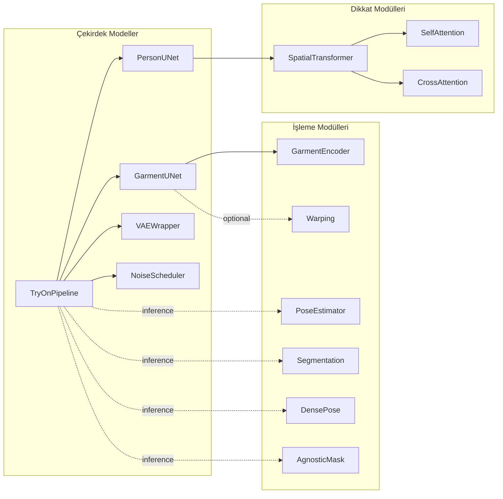

# DiffFit-3D: Mimari Açıklama (Architecture Deep Dive)

## Görsel Mimari Diyagramı



---

## 1. Genel Bakış (Overview)

DiffFit-3D, **"Attention Is All You Need"** makalesindeki Transformer mimarisinden ilham alan ikili-dal (dual-branch) bir **Latent Diffusion Model (LDM)** mimarisidir. Sistem, sanal giysi deneme (virtual try-on) problemini çözmek için iki temel UNet ağını çapraz dikkat (cross-attention) mekanizmasıyla birleştirir.

### Temel Felsefe

Mevcut 2D sanal giysi deneme yöntemleri, perspektif tutarsızlıkları (yan/arka görünümler), vücut tipi çeşitliliği ve oklüzyon (kapanma) sorunlarıyla karşı karşıyadır. DiffFit-3D bu sorunları şu şekilde ele alır:

1. **3D Geometri Farkındalığı**: SMPL-X beden modeli ve DensePose IUV haritaları kullanarak 3D vücut geometrisini anlar
2. **İkili-Dal Difüzyon**: Kişi ve giysi bilgilerini ayrı dallarda işleyip çapraz dikkat ile birleştirir
3. **ControlNet Koşullandırma**: Poz, segmentasyon ve DensePose haritalarıyla geometrik tutarlılığı sağlar
4. **Latent Uzay İşleme**: Hesaplama verimliliği için tüm difüzyon sürecini VAE'nin latent uzayında gerçekleştirir

---

## 2. Giriş Katmanı (Input Layer)

### 2.1 Kişi Görüntüsü (Person Image)
```
Boyut: (B, 3, 512, 512) — RGB formatında
```
Kişi görüntüsü, pipeline'a girmeden önce bir dizi ön-işleme adımından geçer:

- **Poz Tahmini (Pose Estimation)**: DWPose/OpenPose modelleri kullanılarak 18 anahtar nokta (COCO-18 formatı) çıkarılır
- **İnsan Segmentasyonu**: ATR modeli ile 18 sınıflı vücut parçası segmentasyonu
- **DensePose Çıkarımı**: Yüzey karşılık (IUV) haritaları — 24 vücut bölgesi
- **Agnostik Maske**: Giysi bölgesi maskelenerek kişinin kimlik bilgileri korunur

### 2.2 Giysi Görüntüsü (Garment Image)  
```
Boyut: (B, 3, 512, 512) — Düz arka plan üzerinde giysi
```
Giysi görüntüsü, CLIP ViT-L/14 veya DINOv2 tabanlı önceden eğitilmiş bir görsel kodlayıcıdan geçirilir.

### 2.3 Koşullandırma Sinyalleri
```
Agnostik Maske:  (B, 3, 512, 512) — Giysi bölgesi maskelenmiş kişi
Poz Haritası:    (B, 3, 512, 512) — İskelet render'ı (RGB)
DensePose IUV:   (B, 3, 512, 512) — I(parça indeksi)/U/V yüzey koordinatları
Segmentasyon:    (B, 1, 512, 512) — 18 sınıflı etiket haritası
```

---

## 3. VAE — Variational Autoencoder

### 3.1 Yapı

VAE, Stable Diffusion 1.5 ile uyumlu bir enkoder-dekoder mimarisine sahiptir:

```
Enkoder: Görüntü (3, 512, 512) → Latent (4, 64, 64)
Dekoder: Latent (4, 64, 64) → Görüntü (3, 512, 512)
Ölçekleme Faktörü: 0.18215
```

### 3.2 Enkoder Detayları

```
Giriş → Conv2d(3, 128, k=3) → [4 × DownBlock] → Orta Blok → Conv2d → μ, log(σ²)
```

Her `DownBlock` şunları içerir:
- 2 × Residual Block (GroupNorm → SiLU → Conv2d)
- (isteğe bağlı) Self-Attention katmanı
- Downsampling (Conv2d stride=2)

Kanal progresyonu: `128 → 256 → 512 → 512`

### 3.3 Reparametrizasyon (Reparameterization Trick)

```python
z = μ + σ × ε,  burada ε ~ N(0, I)
```

Bu teknik, VAE'nin eğitilmesini mümkün kılar çünkü geri yayılım (backpropagation) stokastik örnekleme adımından geçebilir.

### 3.4 Dekoder Detayları

Enkoderin simetrik tersidir:
```
Latent → Orta Blok → [4 × UpBlock] → GroupNorm → SiLU → Conv2d(128, 3, k=3) → Görüntü
```

> **Önemli**: VAE ağırlıkları eğitim sırasında **dondurulur** (frozen). Sadece UNet ağları eğitilir.

---

## 4. Person UNet — Kişi İşleme Dalı

Bu, mimarinin ana omurgasıdır. Transformer'daki Decoder rolüne benzer şekilde, tüm koşullandırma sinyallerini birleştirir.

### 4.1 Genel Yapı

```
Giriş: concat(noisy_latent, agnostic_latent, pose_map, densepose) → (B, 9+, 64, 64)

Encoder:  [4 × DownBlock]  — Kanal: 320 → 640 → 1280 → 1280
Orta:     MidBlock          — 1280 kanal
Decoder:  [4 × UpBlock]    — Kanal: 1280 → 1280 → 640 → 320

Çıkış: Conv2d(320, 4) → ε̂ (tahmin edilen gürültü)
```

### 4.2 Zaman Adımı Gömmeleme (Timestep Embedding)

Transformer'daki pozisyonel kodlamaya benzer şekilde, difüzyon zaman adımı sinüzoidal fonksiyonlarla kodlanır:

```python
# Sinüzoidal gömmeleme (Vaswani et al., 2017'den uyarlanmıştır)
emb = sin(t / 10000^(2i/d)) ⊕ cos(t / 10000^(2i/d))

# MLP ile projeksiyonu
time_emb = Linear(SiLU(Linear(emb)))   →   (B, 4·d_model)
```

Bu gömmeleme, her Residual Block'a enjekte edilir:
```
h = h + Linear(SiLU(time_emb))
```

### 4.3 ControlNet Koşullandırma Bloğu

ControlNet, ek geometrik bilgiyi (poz, DensePose) UNet'e enjekte eden paralel bir kodlama yapısıdır:

```
Poz+DensePose+Segmentasyon → Conv2d(N, 16) → Conv2d(16, 32) → Conv2d(32, 96) → Conv2d(96, 320)
                             ↓
                          [4 × Koşullandırma Katmanı]
                             ↓
                      her seviyede → Person UNet Encoder'a eklenir
```

Her seviyede üretilen koşullandırma haritası, Person UNet'in karşılık gelen encoder katmanına **artık bağlantı (residual connection)** olarak eklenir: `h = h + controlnet_output[i]`

### 4.4 Spatial Transformer Bloğu

Bu blok, Transformer mimarisinin temel yapı taşıdır ve her UNet seviyesinde tekrarlanır:

```
┌─────────────────────────────────────────────┐
│              Spatial Transformer              │
│                                               │
│  Girdi x: (B, C, H, W)                       │
│      ↓                                        │
│  Reshape → (B, H×W, C) — token formatı       │
│      ↓                                        │
│  ┌─────────────────────────┐                  │
│  │  Layer Normalization     │                  │
│  │  Self-Attention          │ ← residual skip  │
│  │  Add & Norm              │                  │
│  │  Cross-Attention         │ ← garment feats  │
│  │  Add & Norm              │                  │
│  │  Feed-Forward (GEGLU)    │ ← residual skip  │
│  │  Add & Norm              │                  │
│  └─────────────────────────┘                  │
│      ↓                                        │
│  Reshape → (B, C, H, W) — uzamsal format     │
│      ↓                                        │
│  Çıktı: x + residual                         │
└─────────────────────────────────────────────┘
```

### 4.5 Self-Attention Mekanizması

Çok başlıklı öz-dikkat (Multi-Head Self-Attention), Transformer'daki standart formülasyonu izler:

```
Q = W_q · x,   K = W_k · x,   V = W_v · x

Attention(Q, K, V) = softmax(Q·K^T / √d_k) · V
```

**Parametreler**:
- Başlık sayısı: `num_heads = 8`
- Başlık boyutu: `d_head = 40` (320/8) veya `d_head = 80` (640/8)
- İsteğe bağlı: Göreceli konum sapması (Relative Position Bias)
- İsteğe bağlı: Pencereli dikkat (Windowed Self-Attention) — büyük çözünürlüklerde bellek verimliliği için

### 4.6 Cross-Attention — Giysi-Kişi Çapraz Dikkat

Bu, mimarinin **en kritik bileşenidir**. Giysi özelliklerinin kişi özelliklerine aktarılmasını sağlar:

```
Q = W_q · person_features    (boyut: d_query)
K = W_k · garment_features   (boyut: d_context)
V = W_v · garment_features   (boyut: d_context)

CrossAttn(Q, K, V) = softmax(Q·K^T / √d_k) · V
```

**Füzyon Tipleri** (yapılandırılabilir):

| Tip | Formül | Kullanım Senaryosu |
|-----|--------|-------------------|
| `add` | `h = h + CrossAttn(h, g)` | Varsayılan, basit ve etkili |
| `concat_proj` | `h = Linear(concat(h, CrossAttn(h, g)))` | Daha zengin füzyon |
| `gated` | `h = h + σ(gate) ⊙ CrossAttn(h, g)` | Öğrenilebilir geçit |

**Çok Ölçekli Çapraz Dikkat (Multi-Scale Cross-Attention)**:

Giysi UNet'ten gelen farklı ölçeklerdeki özellikler ayrı ayrı çapraz dikkat ile birleştirilir ve toplanır:
```
out = ∑_s CrossAttn_s(person_feats, garment_feats_scale_s)
```

### 4.7 Feed-Forward Network (GEGLU)

Standart Transformer FFN yerine, GEGLU (Gated Linear Unit with GELU) aktivasyonu kullanılır:

```python
def GEGLU(x):
    x, gate = Linear(x).chunk(2, dim=-1)
    return x * GELU(gate)

FFN(x) = Dropout(Linear(GEGLU(x)))
```

GEGLU, standart ReLU/GELU'dan daha iyi gradyan akışı sağlar ve difüzyon modellerinde yaygın olarak kullanılır.

### 4.8 Add & Norm (Artık Bağlantı + Normalizasyon)

Her alt katmandan sonra:
```
output = LayerNorm(x + SubLayer(x))
```

Bu, Transformer'daki "Add & Norm" kalıbıyla birebir örtüşür ve derin ağlarda gradyan akışını stabilize eder.

---

## 5. Garment UNet — Giysi İşleme Dalı

Transformer'daki Encoder rolüne benzer şekilde, giysi bilgisini kodlar ve Person UNet'e çapraz dikkat yoluyla sağlar.

### 5.1 Ön-Kodlayıcı (Garment Encoder)

```
┌──────────────────────────────────────┐
│         Garment Encoder              │
│                                      │
│  Giysi Görüntüsü (B, 3, 512, 512)   │
│         ↓                            │
│  ┌──────────────────┐                │
│  │ CLIP ViT-L/14    │  (dondurulmuş) │
│  │   veya           │                │
│  │ DINOv2 ViT-L     │                │
│  └──────────────────┘                │
│         ↓                            │
│  Hidden States: (B, 256, 768)        │
│         ↓                            │
│  ┌──────────────────────────┐        │
│  │ Çok Ölçekli Projeksiyonlar│       │
│  │ Scale 1: Linear(768→256) │        │
│  │ Scale 2: Linear(768→512) │        │
│  │ Scale 3: Linear(768→1024)│        │
│  │ Scale 4: Linear(768→1024)│        │
│  └──────────────────────────┘        │
│         ↓                            │
│  [4 × öğrenilebilir ölçek tokeni]    │
└──────────────────────────────────────┘
```

Her projeksiyon katmanı: `Linear → LayerNorm → GELU → Linear`

**Öğrenilebilir Ölçek Tokenleri**: Her ölçek seviyesi için ayrı bir öğrenilebilir parametre vektörü, modelin farklı detay seviyelerine odaklanmasını sağlar.

### 5.2 Garment UNet Gövdesi

```
Giriş: VAE.encode(garment_image)  →  (B, 4, 64, 64)

Encoder Blokları:
  Block 1: Conv(4→320)    + ResBlock + Self-Attn → feats_1 (B, 320, 64, 64)
  Block 2: Down + ResBlock + Self-Attn            → feats_2 (B, 640, 32, 32)
  Block 3: Down + ResBlock + Self-Attn            → feats_3 (B, 1280, 16, 16)
  Block 4: Down + ResBlock + Self-Attn            → feats_4 (B, 1280, 8, 8)

Özellik Projeksiyonu:
  feats_1 → flatten → Linear(320, context_dim) → garment_tokens_1
  feats_2 → flatten → Linear(640, context_dim) → garment_tokens_2
  ...
```

### 5.3 Çok Ölçekli Özellik Çıkarımı

Giysi UNet, dört farklı çözünürlükte özellik çıkarır:

| Ölçek | Çözünürlük | Kanal | Yakaladığı Bilgi |
|-------|-----------|-------|-----------------|
| 1/1 | 64×64 | 320 | İnce dokular, dikişler, düğmeler |
| 1/2 | 32×32 | 640 | Desen tekrarları, yaka detayları |
| 1/4 | 16×16 | 1280 | Giysi silüeti, genel yapı |
| 1/8 | 8×8 | 1280 | Global stil, renk dağılımı |

Bu çok ölçekli yaklaşım, hem ince detayların hem de genel yapının korunmasını sağlar — tıpkı Feature Pyramid Network (FPN) mantığıyla.

---

## 6. Gürültü Zamanlayıcı (Noise Scheduler)

### 6.1 İleri Süreç (Forward Process) — Gürültü Ekleme

Difüzyon modelleri, temiz bir veriyi kademeli olarak Gaussian gürültüye dönüştürür:

```
q(x_t | x_0) = N(x_t; √(ᾱ_t) · x_0, (1 - ᾱ_t) · I)

x_t = √(ᾱ_t) · x_0 + √(1 - ᾱ_t) · ε,   ε ~ N(0, I)
```

Burada:
- `β_t`: Her adımdaki gürültü zamanlama katsayısı
- `α_t = 1 - β_t`
- `ᾱ_t = ∏_{s=1}^{t} α_s` (kümülatif çarpım)

### 6.2 Beta Zamanlama Şemaları

| Şema | Formül | Karakteristik |
|------|--------|---------------|
| **Lineer** | `β_t = β_start + t·(β_end - β_start)/T` | Basit, SD 1.5 varsayılanı |
| **Ölçeklenmiş Lineer** | `β_t = (√β_start + t·(√β_end - √β_start)/T)²` | Daha yavaş başlangıç |
| **Kosinüs** | `ᾱ_t = cos²(π/2 · (t/T + s)/(1+s))` | En pürüzsüz geçiş |

### 6.3 Ters Süreç (Reverse Process) — Gürültü Giderme

#### DDPM (Denoising Diffusion Probabilistic Model)

```
p_θ(x_{t-1} | x_t) = N(x_{t-1}; μ_θ(x_t, t), σ_t² · I)

μ_θ(x_t, t) = (1/√α_t) · (x_t - (β_t/√(1-ᾱ_t)) · ε_θ(x_t, t))
```

Her adımda:
1. UNet gürültüyü tahmin eder: `ε̂ = UNet(x_t, t, koşullar)`
2. Tahmin edilen gürültü çıkarılır
3. Stokastik gürültü eklenir (DDPM) veya eklenmez (DDIM)

#### DDIM (Denoising Diffusion Implicit Model)

DDIM, aynı modeli kullanarak **daha az adımla** (ör. 50 yerine 20) çıkarım yapabilir:

```
x_{t-1} = √(ᾱ_{t-1}) · x̂_0 + √(1 - ᾱ_{t-1} - σ²) · ε̂ + σ · ε

burada x̂_0 = (x_t - √(1-ᾱ_t) · ε̂) / √(ᾱ_t)
```

`η = 0` olduğunda tamamen deterministik (tekrarlanabilir sonuçlar).

---

## 7. Eğitim Süreci (Training Pipeline)

### 7.1 İleri Geçiş (Forward Pass)

```
1. x_0 = VAE.encode(person_image)         → (B, 4, 64, 64) latent
2. g   = VAE.encode(garment_image)         → (B, 4, 64, 64) latent
3. ε ~ N(0, I)                             → rastgele gürültü
4. t ~ U(0, T)                             → rastgele zaman adımı
5. x_t = √(ᾱ_t)·x_0 + √(1-ᾱ_t)·ε        → gürültülü latent
6. cond = concat(agnostic, pose, densepose) → koşullandırma girdileri
7. garment_feats = GarmentUNet(g, t)        → çok ölçekli özellikler
8. ε̂ = PersonUNet(x_t, t, cond, garment_feats) → gürültü tahmini
9. loss = ||ε - ε̂||²                       → MSE kaybı
```

### 7.2 Kayıp Fonksiyonu (Loss Function)

Bileşik kayıp fonksiyonu beş bileşenden oluşur:

```
L_total = λ₁·L_L1 + λ₂·L_perceptual + λ₃·L_LPIPS + λ₄·L_adversarial + λ₅·L_KL
```

| Kayıp | Ağırlık | Açıklama |
|-------|---------|----------|
| **L1** | 1.0 | Piksel seviyesinde mutlak hata |
| **VGG Perceptual** | 0.5 | VGG-19'un 5 katmanından özellik karşılaştırması |
| **LPIPS** | 1.0 | AlexNet tabanlı algısal benzerlik |
| **Adversarial** | 0.1 | PatchGAN ayırt edici ağ |
| **KL Divergence** | 0.0001 | VAE latent uzay düzenlileştirme |

#### VGG Perceptual Loss Detayı
```
L_perc = Σ_{l=1}^{5} w_l · ||VGG_l(pred) - VGG_l(target)||_1

Katman ağırlıkları: [1/32, 1/16, 1/8, 1/4, 1]
```
Erken katmanlar dokuyu, geç katmanlar semantik yapıyı yakalar.

### 7.3 Optimizasyon

```
Optimizer:     AdamW (β₁=0.9, β₂=0.999, weight_decay=0.01)
Öğrenme Hızı:  1e-5 (peak)
LR Scheduler:  Cosine Annealing + 1000 adım Warmup
    warmup:    0 → 1e-5 (lineer artış)
    cosine:    1e-5 → 1e-7 (kosinüs azalma)
Mixed Precision: FP16 (GradScaler ile)
Gradient Accumulation: 4 adım
Max Gradient Norm: 1.0 (gradient clipping)
```

### 7.4 EMA (Exponential Moving Average)

Model ağırlıklarının hareketli ortalaması, daha kararlı çıkarım için tutulur:

```
θ_ema ← decay · θ_ema + (1 - decay) · θ_model

decay = 0.9999
update_after = 100 adım
update_every = 10 adım
```

Çıkarım sırasında EMA ağırlıkları kullanılır, orijinal ağırlıklar eğitim için saklanır.

---

## 8. Çıkarım Süreci (Inference Pipeline)

### 8.1 Adım Adım Oluşturma

```
1. Ön-işleme: Kişi → poz, segmentasyon, DensePose, agnostik maske çıkar
2. Latent başlatma: x_T ~ N(0, I)  →  (B, 4, 64, 64)
3. Giysi kodlama: garment_feats = GarmentUNet(VAE.encode(garment), ·)
4. Ters difüzyon döngüsü (T=50 adım):
   for t in [T, T-1, ..., 1]:
       a) Gürültü tahmini: ε̂ = PersonUNet(x_t, t, cond, garment_feats)
       b) Sınıflandırıcısız rehberlik:
          ε̂_guided = ε̂_unconditional + w·(ε̂_conditional - ε̂_unconditional)
       c) x_{t-1} = DDIM_step(x_t, ε̂_guided, t)
5. Dekodlama: result = VAE.decode(x_0)
6. Son-işleme: Yüz restorasyonu, kenar yumuşatma, renk düzeltme
```

### 8.2 Sınıflandırıcısız Rehberlik (Classifier-Free Guidance)

```
ε̂ = ε_unconditional + w · (ε_conditional - ε_unconditional)

w = guidance_scale (tipik: 7.5)
```

`w > 1` olduğunda, koşullandırma sinyalinin etkisi güçlendirilir. Bu, giysi detaylarının daha net aktarılmasını sağlar ancak çok yüksek değerler (>15) aşırı doygunluğa neden olabilir.

---

## 9. Video Try-On Modülleri

### 9.1 Temporal Attention

AnimateDiff mimarisinden ilham alır. Her uzamsal konumun zamansal boyut boyunca dikkat yapmasını sağlar:

```
Giriş: (B, T, H×W, C) — video özellikleri

1. Her uzamsal konum bağımsız olarak zamansal dikkat yapar:
   (B·N) × T × C formatına dönüştürülür
   
2. Zamansal pozisyonel kodlama eklenir

3. Standart çok başlıklı dikkat:
   Q·K^T/√d sonucu çerçeveler arası bağımlılıkları öğrenir

4. Sıfır-başlatma (zero-init): Çıkış projeksiyonu sıfırlarla başlatılır
   → Eğitimin başında artık bağlantı kimlik fonksiyonu olarak çalışır
   → Pretrained image model bozulmaz
```

### 9.2 Motion Module

```
MotionModule = N × MotionTransformerBlock

Her MotionTransformerBlock:
  1. Temporal Self-Attention  (çerçeveler arası hareket dinamikleri)
  2. Feed-Forward Network     (özellik dönüşümü)
```

### 9.3 Kumaş Fizik Modeli

```
GirdiIer: body_motion (B, T, D), cloth_features (B, T, D), material_type

1. motion_encoded = MLP(body_motion) + MaterialEmbedding(type)
2. physics_features = N × PhysicsTransformerLayer(motion, cloth)
3. deformation = DeformationHead(physics_features)

PhysicsTransformerLayer:
  - Temporal self-attention     (hareket dinamikleri)
  - Cross-attention (hareket ↔ kumaş)  (kumaş-hareket etkileşimi)
  - FFN
```

8 farklı kumaş tipi gömmelemesi: pamuk, ipek, denim, deri, şifon, kadife, naylon, yün

---

## 10. Son-İşleme (Post-Processing)

### 10.1 Yüz Restorasyonu
Orijinal yüz bölgesi, Haar Cascade ile tespit edilir ve Gaussian bulanıklaştırma maskesiyle sonuç görüntüye karıştırılır.

### 10.2 Kenar Yumuşatma
Bilateral filtre, kenar koruyucu yumuşatma uygular (`0.7·orijinal + 0.3·yumuşatılmış`).

### 10.3 Renk Düzeltme
Histogram eşleştirme ile sonuç görüntünün renk dağılımı orijinal kişi görüntüsüne yakınlaştırılır.

---

## 11. Veri Akış Diyagramı



---

## 12. Modül Bağımlılık Haritası



---

## 13. Hiperparametre Özeti

| Parametre | Değer | Açıklama |
|-----------|-------|----------|
| Çözünürlük | 512×512 | Giriş/çıkış görüntü boyutu |
| Latent boyut | 64×64×4 | VAE latent uzay |
| Model kanalları | 320 | Temel kanal sayısı |
| Kanal çarpanları | [1, 2, 4, 4] | 320→640→1280→1280 |
| Dikkat çözünürlükleri | [4, 2, 1] | Dikkat uygulanan seviyeler |
| Dikkat başlıkları | 8 | Her katmandaki baş sayısı |
| Difüzyon adımları (eğitim) | 1000 | T |
| Difüzyon adımları (çıkarım) | 50 | DDIM adımları |
| Rehberlik ölçeği | 7.5 | Classifier-free guidance |
| Batch boyutu | 8 (etkili: 32) | 4× gradyan birikimi |
| Öğrenme hızı | 1e-5 | AdamW |
| EMA bozunma | 0.9999 | Ağırlık ortalaması |
| VAE ölçek faktörü | 0.18215 | SD 1.5 uyumlu |

---

## 14. Transformer Mimarisi ile Karşılaştırma

| Kavram | Transformer (NLP) | DiffFit-3D |
|--------|-------------------|------------|
| **Encoder** | Metin kodlayıcı | Garment UNet |
| **Decoder** | Metin çözücü | Person UNet |
| **Self-Attention** | Token-token dikkat | Uzamsal özellik dikkat |
| **Cross-Attention** | Encoder→Decoder | Garment→Person |
| **Positional Encoding** | Sinüzoidal/öğrenilebilir | Timestep embedding |
| **Feed-Forward** | ReLU FFN | GEGLU FFN |
| **Add & Norm** | Residual + LayerNorm | Residual + GroupNorm/LayerNorm |
| **Output** | Token olasılıkları | Gürültü tahmini ε̂ |
| **Autoregressive** | Evet (sıralı) | Hayır (iteratif difüzyon) |

---

> **Sonuç**: DiffFit-3D, Transformer'ın "self-attention + cross-attention + feed-forward" temel yapı taşlarını, 2D konvolüsyonel UNet omurgasıyla ve latent difüzyon süreciyle birleştiren hibrit bir mimaridir. Giysi-kişi etkileşimini çapraz dikkat ile modelleyerek, geometrik tutarlılığı ControlNet koşullandırmasıyla sağlayarak, ve çok ölçekli özellik çıkarımıyla hem ince detayları hem de global yapıyı koruyarak son teknoloji sanal giysi deneme sonuçları üretir.
